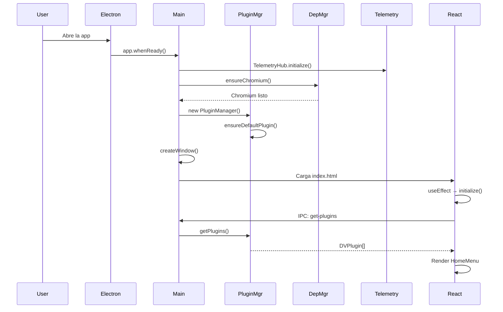
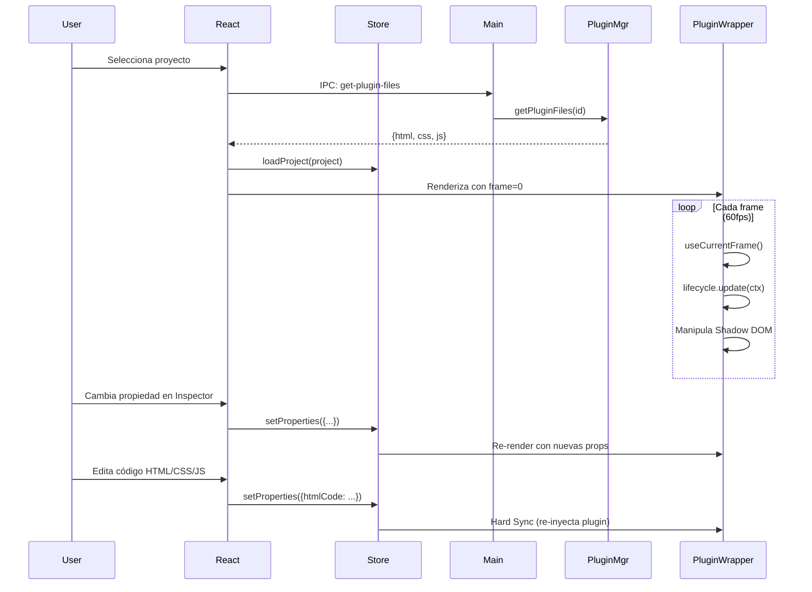
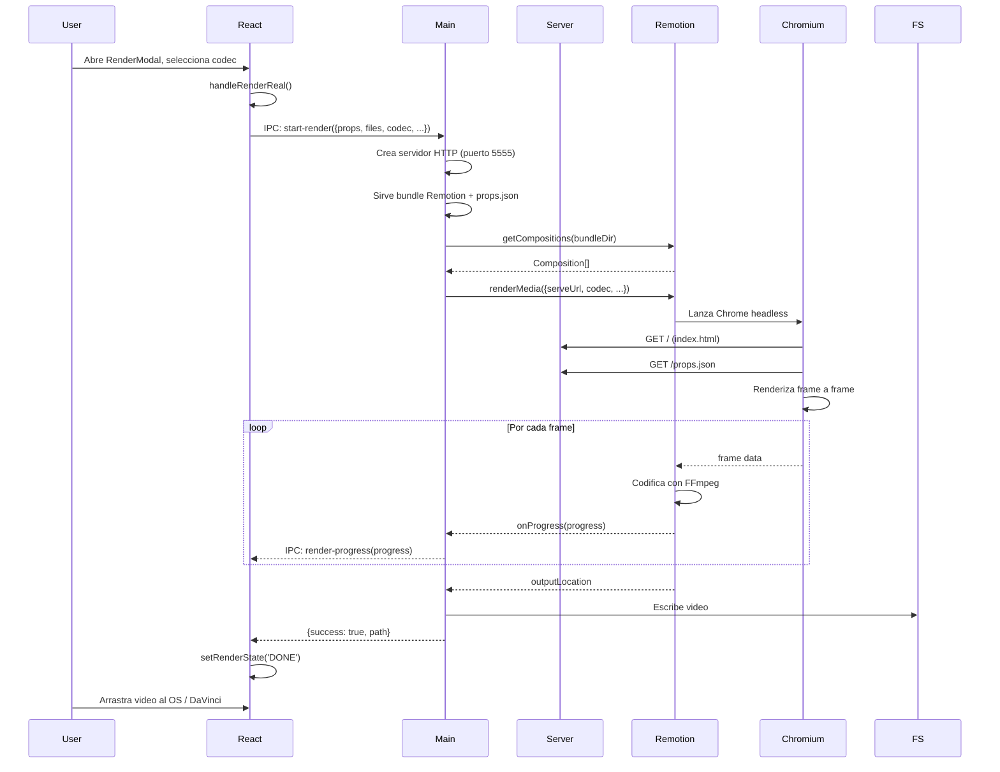
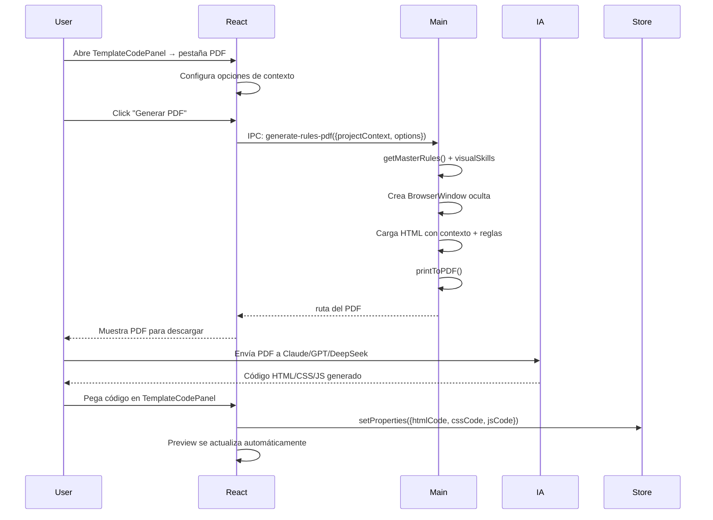
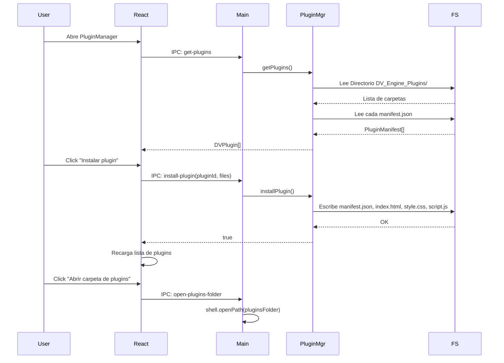
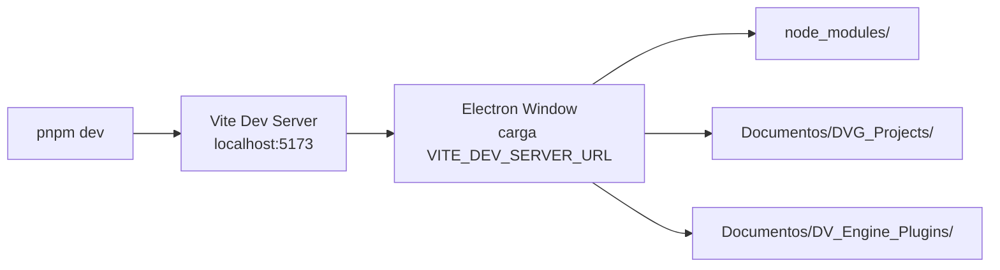

# Documentación Arc42 — Ember Motion Studio v5.9.0

## 1. Introducción y Objetivos

### 1.1 Propósito del Sistema

**Ember Motion Studio** es un estudio de animación broadcast de escritorio que permite crear, previsualizar y exportar gráficos profesionales para televisión (lower thirds, barras de datos, títulos animados, etc.) con canal alfa (transparencia nativa).

El sistema combina:

- Un **motor de renderizado determinista** (DVGE) que garantiza que el preview en tiempo real sea idéntico frame a frame al video exportado.
- Un **sistema de plugins** HTML/CSS/JS donde cada gráfico es una plantilla con propiedades editables desde un Inspector visual.
- Un **AI Context Builder** que genera un PDF con el contexto completo del proyecto para que una IA (Claude, GPT, DeepSeek) pueda generar o modificar el código de animación.
- **Exportación profesional** a ProRes 4444 (con alfa), H.264, WebM, GIF, y secuencias PNG/JPG.

### 1.2 Stakeholders

| Rol | Interés |
| --- | --- |
| **Diseñador broadcast** | Crear gráficos sin programar, usando plantillas |
| **Editor de video** | Exportar gráficos con transparencia para DaVinci Resolve / Premiere |
| **Desarrollador de plugins** | Escribir plantillas HTML/CSS/JS con la API DVGE |
| **Ingeniero de software** | Mantener y evolucionar la plataforma |

### 1.3 Objetivos de Calidad

1. **Determinismo visual**: Preview y export deben producir exactamente el mismo resultado frame a frame.
2. **Aislamiento**: Los plugins se ejecutan en Shadow DOM para no contaminar el Studio ni entre sí.
3. **Formato broadcast**: Exportación a ProRes 4444 con canal alfa.
4. **Extensibilidad**: Sistema de plugins basado en HTML/CSS/JS sin compilación.

---

## 2. Restricciones Arquitectónicas

| Restricción | Detalle |
| --- | --- |
| **Plataforma** | Windows (NSIS installer). Electron limita a OS con soporte Chromium |
| **Tecnologías** | Electron 29 + React 18 + Vite 5. No se puede cambiar el stack base |
| **Sandbox** | `contextIsolation: true`, `nodeIntegration: false`. El renderer no tiene acceso directo a Node.js |
| **Distribución** | Empaquetado con `electron-builder` como ASAR. El runtime Remotion necesita `asarUnpack` |
| **Dependencia externa** | Chromium instalado en el sistema (o descargado automáticamente) para renderizado headless con Remotion |
| **Remotion v4** | Versión fija 4.0.465. El bundle de Remotion se genera offline con `bundle-remotion.js` |

---

## 3. Contexto y Alcance

### 3.1 Diagrama de Contexto

```mermaid
graph TB
    subgraph "Ember Motion Studio"
        App[App Electron]
    end

    User[Usuario Diseñador/Editor]
    FS[Sistema de Archivos<br/>Documentos/DVG_Projects]
    IA[Claude / GPT / DeepSeek]
    GitHub[GitHub Plugins Registry]
    Chromium[Chromium Headless]
    FFmpeg[FFmpeg<br/>(vía Remotion)]

    User -- "Edita propiedades,<br/>previsualiza, exporta" --> App
    App -- "Persiste proyectos" --> FS
    App -- "Genera PDF de contexto" --> User
    User -- "Envía PDF a IA" --> IA
    IA -- "Devuelve código HTML/CSS/JS" --> User
    User -- "Pega código en el Studio" --> App
    App -- "Descarga registry.json" --> GitHub
    App -- "Renderiza video headless" --> Chromium
    Chromium -- "Codifica con FFmpeg" --> FFmpeg
    App -- "Lee/Escribe plugins" --> FS
```

### 3.2 Límites del Sistema

**Dentro del alcance:**

- Editor de gráficos broadcast con preview en tiempo real
- Sistema de plugins local con manifest + HTML/CSS/JS
- Exportación de video en múltiples formatos profesionales
- Generación de contexto para IA (PDF)
- Gestión de proyectos (CRUD)
- Telemetría anónima (PostHog + HardwareScanner)

**Fuera del alcance:**

- Edición de video no lineal (NLE)
- Renderizado en servidor/cloud (solo local)
- Marketplace de plugins (previsto para v6)
- Colaboración multi-usuario en tiempo real

---

## 4. Estrategia de Solución

### 4.1 Principios de Diseño

| Principio | Justificación |
| --- | --- |
| **Determinismo** | El preview y el export deben producir exactamente la misma salida visual. Se logra usando el mismo motor (Remotion) con los mismos flags |
| **Aislamiento por Shadow DOM** | Cada plugin se ejecuta en un Shadow Root con su propio DOM y estilos, sin contaminar el Studio ni otros plugins |
| **Bridge seguro via IPC** | `contextBridge` expone solo métodos específicos al renderer. El proceso main maneja archivos, renderizado y telemetría |
| **Persistence atómica** | Los proyectos se guardan como archivos JSON en `Documents/DVG_Projects/` con escritura directa (sin base de datos) |
| **Plugins sin compilación** | Los plugins son HTML/CSS/JS planos. Sin bundler, sin dependencias, sin build step |

### 4.2 Tecnologías Clave

```mermaid
graph LR
    subgraph "Frontend (Renderer Process)"
        React[React 18]
        Zustand[Zustand Store]
        Remotion[Remotion Player]
    end

    subgraph "Backend (Main Process)"
        Electron[Electron 29]
        RemotionRenderer[Remotion Renderer]
        PluginMgr[Plugin Manager]
        ProjectMgr[Project Manager]
    end

    subgraph "Runtime Bridge"
        DVGE[@dvge/runtime-bridge]
    end

    React --> Zustand
    React --> Remotion
    Remotion --> DVGE
    Zustand --> IPC[IPC contextBridge]
    IPC --> Electron
    Electron --> RemotionRenderer
    Electron --> PluginMgr
    Electron --> ProjectMgr
```

---

## 5. Vista de Bloques (Building Block View)

### 5.1 Descomposición del Sistema

```mermaid
graph TB
    subgraph "Processo Main (Electron)"
        Main[main.ts]
        RemotionAPI[remotion-api.ts]
        PluginMgr[plugin-manager.ts]
        ProjectMgr[project-manager.ts]
        DepMgr[dependency-manager.ts]
        Telemetry[TelemetryHub]
        
        Main --> RemotionAPI
        Main --> PluginMgr
        Main --> ProjectMgr
        Main --> DepMgr
        Main --> Telemetry
    end

    subgraph "Preload Bridge"
        Preload[preload.ts]
    end

    subgraph "Renderer Process (React)"
        App[App.tsx]
        Store[useStore.ts]
        Preview[PreviewPlayer.tsx]
        PluginWrapper[PluginWrapper.tsx]
        RenderWrapper[RenderWrapper.tsx]
        Components[Components/]
        
        App --> Store
        App --> Preview
        Preview --> PluginWrapper
        App --> Components
    end

    subgraph "Runtime DVGE"
        RuntimeBridge[@dvge/runtime-bridge]
    end

    Preload --> Main
    Store --> Preload
    PluginWrapper --> RuntimeBridge
    RenderWrapper --> RuntimeBridge
```

### 5.2 Proceso Main (Electron) — `electron/`

| Módulo | Responsabilidad |
| --- | --- |
| `main.ts` | Punto de entrada. Crea ventanas, configura IPC handlers, inicializa gestores, telemetría, menú |
| `remotion-api.ts` | Orquestador de renderizado Remotion. Inicia servidor HTTP local, llama a `getCompositions`/`renderMedia`, maneja codecs |
| `plugin-manager.ts` | Escanea `Documents/DV_Engine_Plugins/`, parsea manifests, lee archivos HTML/CSS/JS. Crea plugins por defecto |
| `project-manager.ts` | CRUD de proyectos en `Documents/DVG_Projects/` |
| `dependency-manager.ts` | Asegura que Chromium esté instalado para render headless |
| `preload.ts` | Bridge seguro via `contextBridge`. Expone ~30 métodos IPC |
| `telemetry/TelemetryHub.ts` | Inicializa y gestiona PostHog (lado main) |
| `telemetry/MachineIdentityProvider.ts` | ID anónimo de máquina |
| `telemetry/HardwareScanner.ts` | Escanea GPU/CPU/RAM usando `systeminformation` |
| `resources/MASTER_PROMPT.md` | Prompt maestro del motor DVGE (560 líneas) |
| `resources/visualSkills.ts` | Habilidades visuales deterministas (presets de estilo) |

### 5.3 Renderer Process (React) — `src/`

| Módulo | Responsabilidad |
| --- | --- |
| `App.tsx` | Componente raíz. Maneja pantalla de carga, HomeMenu vs Studio, layout de 3 columnas (left panel + preview + right panel) |
| `main.tsx` | Entry point React con Error Boundary global |
| `store/useStore.ts` | Store Zustand con ~50 propiedades de estado global |
| `store/presets.ts` | Registro de presets visuales |
| `remotion/PreviewPlayer.tsx` | Envuelve `<Player>` de Remotion para preview interactivo |
| `remotion/PluginWrapper.tsx` | Motor de preview interactivo con Shadow DOM, ciclo de vida DVGE, escalado universal |
| `remotion/RenderWrapper.tsx` | Versión headless sin Shadow DOM para export determinista |
| `remotion/Root.tsx` | Composición raíz del bundle de Remotion (`dvge-render-engine`) |
| `components/` | 29 componentes: HomeMenu, InspectorTabs, ArtifactsPanel, RenderModal, TitleBar, TemplateCodePanel, etc. |
| `i18n/translations.ts` | 700+ líneas de traducciones ES/EN |
| `i18n/useTranslation.ts` | Hook de internacionalización |
| `services/telemetry.ts` | PostHog en el renderer |
| `services/TagExtractor.ts` | Extrae schema `@dv-prop` del código HTML/CSS/JS |
| `styles/resolve-theme.css` | Tema oscuro |

### 5.4 Runtime Bridge (`@dvge/runtime-bridge`)

Dependencia externa v6.0.0-beta.1 que proporciona:

- `dvUtils`: utilidades de animación (lerp, easing)
- `calculateTimeline`: calcula timeline global con marcas de tiempo
- `executePluginSandbox`: ejecuta JS del plugin en un sandbox controlado
- Tipos: `DVLifecycle` (awake, start, update), `DVContext` (frame, root, props, utils, timeline)

### 5.5 Componentes Clave de UI

```mermaid
graph TB
    App --> TitleBar
    App --> HomeMenu
    App --> StudioLayout
    
    subgraph "StudioLayout"
        LeftPanel --> ProjectConfigPanel
        LeftPanel --> InspectorTabs
        LeftPanel --> ActionFooter
        
        CenterPanel --> PreviewPlayer
        CenterPanel --> RenderStatusPanel
        
        RightPanel --> InspectorTabs
        RightPanel --> ArtifactsPanel
    end

    StudioLayout --> TemplateCodePanel[TemplateCodePanel<br/>(Modal AI Context)]
    StudioLayout --> RenderModal
    StudioLayout --> WorkflowModal
    StudioLayout --> SettingsModal
```

---

## 6. Vista de Runtime (Runtime View)

### 6.1 Flujo de Inicio de la Aplicación



### 6.2 Flujo de Edición y Preview



### 6.3 Flujo de Exportación de Video



### 6.4 Flujo de AI Context Builder



### 6.5 Flujo de Plugins



---

## 7. Vista de Despliegue

### 7.1 Entorno de Desarrollo



### 7.2 Distribución en Producción

```mermaid
graph TB
    subgraph "Instalador NSIS"
        Setup[EmberMotionStudio-Setup-5.9.0.exe]
    end

    subgraph "Archivos de Programa"
        App[app.asar]
        Unpacked[app.asar.unpacked/]
        Resources[Resources/]
    end

    subgraph "Runtime"
        ElectronExe[electron.exe]
        Chromium[Chromium Headless]
    end

    subgraph "Datos de Usuario"
        Projects[DVG_Projects/]
        Plugins[DV_Engine_Plugins/]
        AppData[AppData/Roaming/EmberMotionStudio/]
    end

    Setup --> App
    Setup --> Unpacked
    Setup --> Resources
    Setup --> ElectronExe
    
    Unpacked --> RemotionBundle[remotion-bundle/]
    Unpacked --> Esbuild[@esbuild/win32-x64/]
    Unpacked --> Compositor[@remotion/compositor-win32-x64-msvc/]

    ElectronExe --> Projects
    ElectronExe --> Plugins
    ElectronExe --> AppData
    AppData --> RemotionCache[.remotion-cache/]
```

### 7.3 Estructura de Datos en Disco

```text
Documents/
├── DVG_Projects/                  # Proyectos de usuario
│   └── {projectId}/               # UUID del proyecto
│       ├── project.json           # Metadata + propiedades
│       ├── assets/                # Archivos multimedia importados
│       ├── artifacts/             # Artefactos generados (recortes, etc.)
│       ├── Exports/               # Videos exportados
│       └── KNOWLEDGE.md           # Conocimiento contextual del proyecto
│
└── DV_Engine_Plugins/             # Plugins instalados
    ├── proyecto-vacio/            # Plugin interno (Studio Master)
    │   ├── manifest.json
    │   ├── index.html
    │   ├── style.css
    │   └── script.js
    ├── lower-third-basic/         # Plugin por defecto
    │   ├── manifest.json
    │   ├── index.html
    │   ├── style.css
    │   └── script.js
    └── ... (otros plugins)
```

---

## 8. Conceptos Transversales (Cross-cutting Concepts)

### 8.1 Comunicación IPC

Toda la comunicación entre el renderer (React) y el main (Electron) se hace a través de `contextBridge`.

**Canales IPC:**

| Canal | Dirección | Propósito |
| --- | --- | --- |
| `start-render` | Renderer → Main | Iniciar renderizado de video |
| `render-progress` | Main → Renderer | Progreso del render (0-1) |
| `get-plugins` | Renderer → Main | Listar plugins instalados |
| `get-plugin-files` | Renderer → Main | Obtener HTML/CSS/JS de un plugin |
| `install-plugin` | Renderer → Main | Instalar/actualizar plugin |
| `get-projects` / `create-project` / etc. | Renderer → Main | CRUD de proyectos |
| `generate-rules-pdf` | Renderer → Main | Generar PDF de contexto para IA |
| `window-minimize` / `maximize` / `close` | Renderer → Main | Control de ventana frameless |
| `show-open-dialog` | Renderer → Main | Selector de archivos nativo |
| `read-file-utf8` | Renderer → Main | Lectura segura de archivos |
| `save-artifact` / `copy-to-project` | Renderer → Main | Gestión de assets |
| `parse-table-file` | Renderer → Main | Parseo CSV/XLSX |
| `fetch-remote-registry` | Renderer → Main | Descargar registry de plugins desde GitHub |
| `download-update` / `install-update` | Renderer → Main | Auto-actualización |
| `get-machine-id` / `get-gpu-info` | Renderer → Main | Telemetría |
| `log-sync` | Renderer → Main | Debug logging |

### 8.2 Manejo de Estado Global (Zustand)

El store central (`useStore.ts`) maneja:

- **Proyecto activo**: objeto completo con metadata, propiedades, artefactos
- **Plugin activo**: manifiesto del plugin seleccionado
- **Plugins instalados**: lista completa
- **Propiedades**: `Record<string, any>` con valores actuales del Inspector
- **Máquina de estados de render**: `IDLE → RENDERING → DONE/ERROR`
- **Settings de app**: idioma, tema, auto-save, flags de tutorial
- **UI State**: tabs activos, modales abiertos, estado de creación de proyecto
- **Context Options**: opciones del AI Context Builder

### 8.3 Ciclo de Vida del Plugin DVGE

Cada plugin puede implementar hasta 3 hooks:

```typescript
dvEngine.register({
  awake: (ctx: DVContext) => {
    // 1. Inicialización única: crear elementos DOM, configurar estado
  },
  start: (ctx: DVContext) => {
    // 2. Trigger al inicio de la animación (frame 0 o primer play)
  },
  update: (ctx: DVContext) => {
    // 3. Lógica por frame: animar, actualizar texto, reposicionar
    // ctx.frame, ctx.props, ctx.timeline disponibles
  }
});
```

**DVContext** expone:

- `frame`: número de frame actual
- `props`: propiedades reactivas del Inspector
- `root`: ShadowRoot del plugin (Preview) o `document` (Render)
- `timeline`: timeline global calculado con fps y duración
- `utils`: utilidades (`lerp`, `easeOutCubic`, etc. de `@dvge/runtime-bridge`)
- `state`: estado mutable del plugin (vive por ciclo de vida)
- `refs`: referencias a elementos DOM cacheadas

### 8.4 Sistema de Preview vs Render

| Aspecto | PluginWrapper (Preview) | RenderWrapper (Export) |
| --- | --- | --- |
| **DOM** | Shadow DOM aislado | DOM normal (document) |
| **Velocidad** | 60fps interactivo | Paso a paso (1 frame a la vez) |
| **Eventos** | Soportados (click, hover) | No aplica |
| **Escalado** | Escalado universal (contain) | Resolución nativa |
| **Fondo** | Checkerboard pattern | Transparente |
| **Uso** | `@remotion/player` | `renderMedia()` / `renderFrames()` |

### 8.5 Seguridad

1. **contextIsolation: true** — El renderer no puede acceder a Node.js directamente
2. **nodeIntegration: false** — No hay `require()` en el renderer
3. **Validación de canales IPC** — `preload.ts` solo permite canales explícitos
4. **Sanitización de schema de plugins** — `plugin-manager.ts` fuerza schema a Array aunque la IA genere objeto
5. **Shadow DOM** — Aislamiento de estilos entre plugins y el Studio
6. **Sandbox de JS** — El JS del plugin se ejecuta via `executePluginSandbox` (no `eval` directo)

### 8.6 Internacionalización

- Sistema basado en claves (no ICU MessageFormat)
- 2 idiomas: Español e Inglés
- `translations.ts` con ~700 líneas
- El idioma se persiste en `localStorage`
- Hook `useTranslation()` que expone `t(key)` y `language`

### 8.7 Telemetría

- **Renderer**: PostHog JS (`posthog-js`) para eventos de UI
- **Main**: TelemetryHub + MachineIdentityProvider + HardwareScanner
- **Identidad**: ID anónimo de máquina (no PII)
- **Hardware**: GPU, CPU, RAM escaneados con `systeminformation`

---

## 9. Decisiones Arquitectónicas

| ID | Decisión | Alternativas | Justificación |
| --- | --- | --- | --- |
| ADR-001 | **Electron + React** para UI de escritorio | Tauri, Qt, NW.js | Ecosistema maduro, Chromium para render Remotion |
| ADR-002 | **Remotion v4** como motor de renderizado | Canvas2D, WebGL nativo, FFmpeg directo | Frame-accurate determinista, codecs profesionales, API declarativa |
| ADR-003 | **Shadow DOM** para aislamiento de plugins | iframes, Web Workers | Ligero, sin overhead de iframe, misma API de DOM |
| ADR-004 | **Zustand** para estado global | Redux, Context API, Jotai | Simple, sin boilerplate, TypeScript nativo |
| ADR-005 | **Plugins como archivos planos** (sin build) | NPM packages, Webpack bundles | Accesible para diseñadores que saben HTML/CSS, no requiere toolchain |
| ADR-006 | **JSON plano** como persistencia (sin DB) | SQLite, IndexedDB | Simple, portable, el usuario puede editar directamente |
| ADR-007 | **ASAR + asarUnpack** para distribución | ASAR completo, sin ASAR | ASAR reduce tamaño, asarUnpack necesario para binarios de Remotion/esbuild |
| ADR-008 | **contextBridge** para IPC seguro | IPC directo, Electron remote | Mejores prácticas de seguridad Electron |
| ADR-009 | **Pantalla de carga secuencial fija** | Carga real asíncrona | UX consistente, oculta latencia real de dependencias |

---

## 10. Requisitos de Calidad

### 10.1 Rendimiento

- **Preview**: 60fps en resoluciones hasta 1920×1080
- **Export**: Velocidad variable según GPU y codec (ProRes 4444 es intensivo)
- **Inicio**: <5 segundos en SSD moderno

### 10.2 Seguridad

- No se ejecuta código arbitrario del usuario fuera del sandbox
- Los plugins no tienen acceso al sistema de archivos ni a la red
- Telemetría anónima sin datos personales

### 10.3 Escalabilidad

- Número de plugins: ilimitado (archivos planos en disco)
- Número de proyectos: ilimitado
- Duración de animación: limitada por memoria (Chromium headless)

### 10.4 Portabilidad

- **Target primario**: Windows 10/11 (NSIS installer)
- **Target futuro**: macOS (v6 roadmap)

---

## 11. Riesgos y Deuda Técnica

### 11.1 Riesgos Identificados

| Riesgo | Impacto | Mitigación |
| --- | --- | --- |
| **Remotion v4 → v5 breaking changes** | Alto — núcleo del renderizado | Pin versión, probar migración en rama separada |
| **Chromium headless en entornos restringidos** | Medio — fallo de render | `dependency-manager` descarga Chromium automáticamente, fallback a Chrome del sistema |
| **Shadow DOM polyfill (`getElementById`)** | Medio — compatibilidad | Polyfill manual en `PluginWrapper.tsx:61-63` |
| **EPERM en Program Files** | Alto — crash en producción | `REMOTION_DOT_REMOTION_DIR` redirigido a `userData` |
| **Plugins generados por IA con código malicioso** | Bajo — sandbox limita daño | Shadow DOM + sandbox `executePluginSandbox` |

### 11.2 Deuda Técnica

| Item | Área | Severidad |
| --- | --- | --- |
| **Sin tests automatizados** | Global | Alta |
| **`App.tsx` con 1052 líneas** | UI | Media |
| **Código duplicado entre `PluginWrapper.tsx` y `RenderWrapper.tsx`** | Render | Media |
| **`main.ts` con 842 líneas y muchos IPC inline** | Main | Alta |
| **`remotion-api.ts` con lógica de codecs inline** | Render | Media |
| **Múltiples rutas de búsqueda para `MASTER_PROMPT.md`** | Configuración | Baja |
| **No hay tipado estricto para IPC (todo `any`)** | IPC | Alta |
| **Zustand store con ~50 propiedades planas** | Estado | Media |
| **Múltiples `@ts-ignore` en el código** | General | Baja |

---

## 12. Glosario

| Término | Definición |
| --- | --- |
| **DVGE** | Dynamic Vector Graphics Engine — motor determinista de gráficos vectoriales |
| **Remotion** | Framework para crear videos programáticos con React |
| **ProRes 4444** | Códec profesional de Apple con soporte de canal alfa (transparencia) |
| **Shadow DOM** | API del navegador que permite DOM y estilos aislados |
| **IPC** | Inter-Process Communication — comunicación entre procesos main y renderer de Electron |
| **contextBridge** | API de Electron para exponer métodos seguros al renderer |
| **ASAR** | Formato de archivo de Electron para empaquetar la app (similar a tar) |
| **NSIS** | Nullsoft Scriptable Install System — instalador para Windows |
| **AI Context Builder** | Herramienta que genera un PDF con el contexto del proyecto para enviar a una IA |
| **Studio Master** | Plugin interno "Proyecto Vacío" que permite editar HTML/CSS/JS directamente |
| **Lower Third** | Gráfico de texto que aparece en la parte inferior de la pantalla en TV |
| **Broadcast** | Estándar de calidad para producción de televisión |
| **Easing** | Función de interpolación que controla la aceleración de una animación |
| **Lerp** | Interpolación lineal entre dos valores |
| **Determinismo** | Propiedad de un sistema donde la misma entrada produce siempre la misma salida |
| **Preset** | Plantilla de estilo predefinida (branding, motion, layout) |
